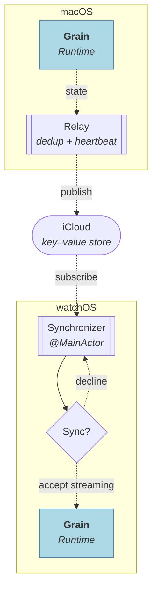

# Project Grain

A macOS menubar interval timer app with watchOS and iOS companions. Alternates between two phases (A and B) on a repeating cycle; the watch and iPhone each run their own independent timer and can optionally sync with a session running on the Mac.

**Stack:** Swift 6 · SwiftUI

## Features

- **Session persistence** — quitting the app or restarting the machine doesn't lose your session; running timers fast-forward through downtime on next launch, paused timers resume at the exact elapsed time
- **Configurable cycle length** — constant, growth, or decay mode controls whether phase durations stay equal or scale across cycles
- **System notifications** on phase and session completion
- **A companion watchOS app** with independent timer control and configurable phase durations; can optionally sync with a running Mac session
- **A companion iOS app** with the same independent timer control and configurable phase durations; can optionally sync with a running Mac session

## Architecture

The app follows Domain-Driven Design with three layers, plus a **Settings** bounded context. Dependencies point inward.

The inner two layers — **Application** and **Domain** — live in the [Grain](https://github.com/vitalydolgov/grain) library, consumed as a dependency. **Presentation** and **Settings** live in this repository.


Cross-device state propagation is described separately under [Synchronization](#synchronization).

### Composition

- **Presentation (desktop)** — macOS menubar UI; includes `RuntimeProxy`, which bridges the actor-based runtime to `@Observable` on the main actor
- **Settings** — a *bounded context* that owns configuration, display preferences, and session restore state
- **Presentation (watch)** — watchOS UI with full timer controls and configurable phase durations; includes `RuntimeProxy` for local control and `RuntimeSynchronizer` for optional Mac sync
- **Presentation (iOS)** — iPhone UI with full timer controls and configurable phase durations; includes `RuntimeProxy` for local control and `RuntimeSynchronizer` for optional Mac sync
- **State transport** — iCloud publisher/subscriber channels (`NSUbiquitousKeyValueStore`) that carry runtime state between devices, with a local channel for debug and the simulator. One-way — no commands flow back. See [Synchronization](#synchronization)
- **Application** and **Domain** — see the [Grain](https://github.com/vitalydolgov/grain) library

Each `RuntimeProxy` is fed by two streams from the Grain runtime:

- **state** — a fresh snapshot after every change, which the proxy unpacks to keep its observable properties in sync. Both Desktop and Watch proxies consume it.
- **signals** — discrete lifecycle events. Only the Desktop proxy consumes them, exposing them so Presentation can react (e.g. notifications) without polling.

### Synchronization

The watch runs its own Grain runtime with full timer control. Optionally, it can sync with a running Mac session: the **Relay** (`RuntimeStateRelay`) carries state over iCloud in one direction, Mac to Watch — no commands flow back.



The desktop runs the relay over its runtime's **state** stream. The relay dedupes — it republishes only when the session status or phase location changes — and writes each surviving snapshot to iCloud's key–value store. A built-in heartbeat (every 5 seconds) re-publishes the last known state so devices that connect late can still discover an active session.

On the watch, `RuntimeSynchronizer` subscribes to the store and tracks a sync mode: `.none` when no session is active remotely, `.pending` when a running or paused session is detected (prompting "Sync with Mac?"), `.synced` after the user accepts, and `.declined` if they dismiss. Only on acceptance does the synchronizer restore state into the watch's own Grain runtime; from there, the runtime's **state** stream drives the Watch `RuntimeProxy` and UI — the same streaming contract as the desktop, populated remotely.

The iOS app consumes the same relay through an identical `RuntimeSynchronizer`, so Mac → device sync works the same way on iPhone as on the watch.

## Building

Generate the Xcode project from `project.yml` with [XcodeGen](https://github.com/yonaskolb/XcodeGen). Create `local.yml` in the project root for developer-specific settings such as `DEVELOPMENT_TEAM`.

```sh
xcodegen generate
```

Re-run whenever you add, remove, or rename source files.

The project generates three schemes, `GrainDesktop` (macOS), `GrainWatch` (watchOS), and `GrainPhone` (iOS).

Build the desktop app:

```sh
xcodebuild build -project GrainApp.xcodeproj -scheme GrainDesktop -destination 'platform=macOS'
```

Build the watch app:

```sh
xcodebuild build -project GrainApp.xcodeproj -scheme GrainWatch -destination 'generic/platform=watchOS Simulator'
```

Build the iOS app:

```sh
xcodebuild build -project GrainApp.xcodeproj -scheme GrainPhone -destination 'generic/platform=iOS Simulator'
```
