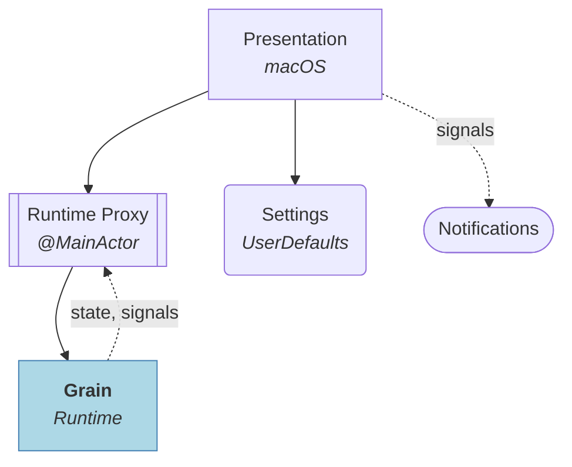
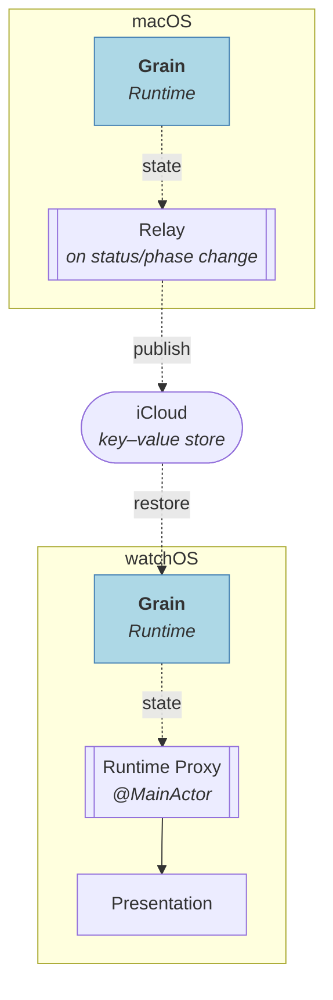

# Project Grain

A macOS menubar interval timer app with a watchOS companion display. Alternates between two phases (A and B) on a repeating cycle; the watch is a read-only mirror of the current timer state.

**Stack:** Swift 6 · SwiftUI

## Features

- **Session persistence** — quitting the app or restarting the machine doesn't lose your session; running timers fast-forward through downtime on next launch, paused timers resume at the exact elapsed time
- **Configurable cycle length** — constant, growth, or decay mode controls whether phase durations stay equal or scale across cycles
- **System notifications** on phase and session completion
- **A companion watchOS app** that mirrors the running timer state from the Mac in real time

## Architecture

The app follows Domain-Driven Design with three layers, plus a **Settings** bounded context. Dependencies point inward.

The inner two layers — **Application** and **Domain** — live in the [Grain](https://github.com/vitalydolgov/grain) library, consumed as a dependency. **Presentation** and **Settings** live in this repository.



Cross-device state propagation is described separately under [Synchronization](#synchronization).

### Composition

- **Presentation (desktop)** — macOS menubar UI; includes `RuntimeProxy`, which bridges the actor-based runtime to `@Observable` on the main actor
- **Settings** — a *bounded context* that owns configuration, display preferences, and session restore state
- **Presentation (watch)** — watchOS mirror UI; includes its own `RuntimeProxy` populated via the relay rather than by commanding the runtime directly
- **State transport** — iCloud publisher/subscriber channels (`NSUbiquitousKeyValueStore`) that carry runtime state between devices, with a local channel for debug and the simulator. One-way — no commands flow back. See [Synchronization](#synchronization)
- **Application** and **Domain** — see the [Grain](https://github.com/vitalydolgov/grain) library

Each `RuntimeProxy` is fed by two streams from the Grain runtime:

- **state** — a fresh snapshot after every change, which the proxy unpacks to keep its observable properties in sync. Both Desktop and Watch proxies consume it.
- **signals** — discrete lifecycle events. Only the Desktop proxy consumes them, exposing them so Presentation can react (e.g. notifications) without polling.

### Synchronization

The watchOS app is a read-only mirror: it issues no control commands of its own and only replays state pushed from the Mac. The **Relay** (`RuntimeStateRelay`) carries that state over iCloud in one direction, Mac to Watch, so nothing flows back.



The desktop runs the relay over its runtime's **state** stream. The relay dedupes — it republishes only when the session status or phase location changes — and writes each surviving snapshot to iCloud's key–value store. On the watch, a subscriber observes the store and restores each state into the watch's own Grain runtime; that runtime's **state** stream then drives the Watch `RuntimeProxy` and UI — the same streaming contract as the desktop, populated remotely.

## Building

Generate the Xcode project from `project.yml` with [XcodeGen](https://github.com/yonaskolb/XcodeGen). Create `local.yml` in the project root for developer-specific settings such as `DEVELOPMENT_TEAM`.

```sh
xcodegen generate
```

Re-run whenever you add, remove, or rename source files.

The project generates two schemes, `GrainDesktop` (macOS) and `GrainWatch` (watchOS).

Build the desktop app:

```sh
xcodebuild build -project GrainApp.xcodeproj -scheme GrainDesktop -destination 'platform=macOS'
```

Build the watch app:

```sh
xcodebuild build -project GrainApp.xcodeproj -scheme GrainWatch -destination 'generic/platform=watchOS Simulator'
```
