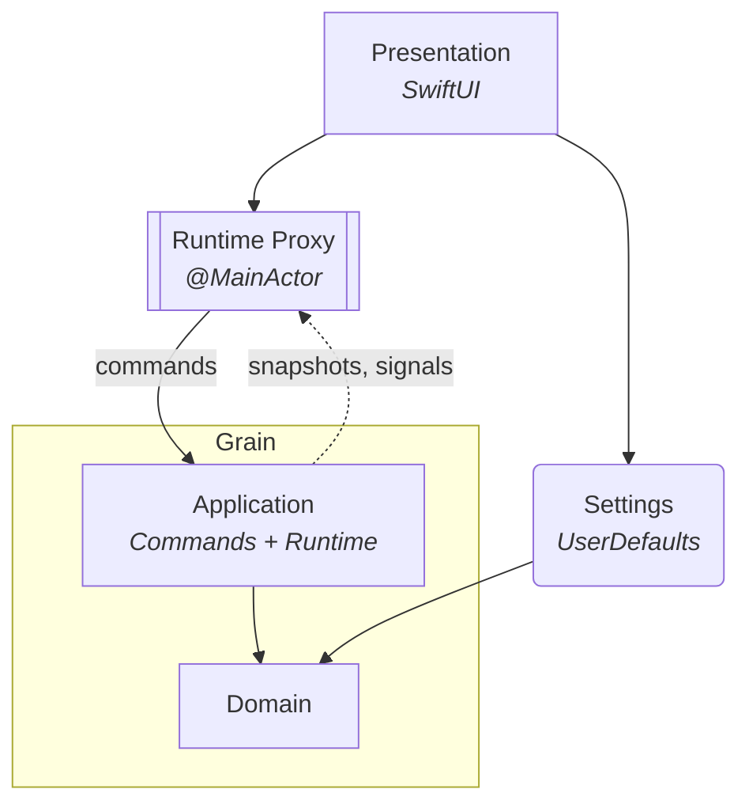

# Grain (desktop)

A macOS menubar interval timer app. Alternates between two configurable phases (A and B) on a repeating cycle.

**Stack:** Swift 6 · SwiftUI

## Architecture

The app follows Domain-Driven Design with three layers, plus a **Settings** bounded context. Dependencies point inward.

The inner two layers — **Application** and **Domain** — live in the [Grain](https://github.com/vitalydolgov/grain) library, consumed as a git submodule at `Core/`. **Presentation** and **Settings** live in this repository.



> The boxed pair (Application + Domain) is the *Grain* library — **Application** drives state transitions via commands and streams state back out; **Domain** holds the timer aggregates and invariants. **Presentation** renders the menubar UI. **Runtime Proxy** (subroutine shape) bridges the actor-based runtime to SwiftUI's `@Observable` system on the main actor. **Settings** (rounded rectangle) stores timer configuration and display preferences in `UserDefaults`; it depends on Domain for shared value types.

### Composition

- **Presentation** (`Sources/Presentation`) — SwiftUI views and `RuntimeProxy`, which bridges the actor-based runtime to `@Observable` on the main actor
- **Application** (`GrainApplication` module) — commands and runtime; drives state transitions from outside the domain
- **Domain** (`GrainDomain` module) — timer aggregates, events, and invariants
- **Settings** (`Sources/Settings`) — a *bounded context* that owns timer configuration (`TimerSettings`) and display preferences (`DisplaySettings`) behind store protocols

#### What goes where — quick test

Before placing code, ask: *would this still make sense if the app were a CLI, a server endpoint, and a desktop application simultaneously?*

- "Yes, as a rule or invariant" → Domain
- "Yes, but something has to drive it" → Application
- "No — only in this UI" → Presentation
- "No — it's a user-configurable preference" → Settings

### Streaming

The Application layer emits two streams that flow back up to `RuntimeProxy`:

- **`snapshots`** — yields a fresh snapshot after every state change; `RuntimeProxy` consumes this to keep its observable properties in sync with the actor
- **`signals`** — surfaces discrete lifecycle events as the public output of the Application layer; `RuntimeProxy` forwards it as-is so Presentation subscribers can react without polling

## Development

After cloning, initialise the submodule and regenerate the Xcode project from `project.yml` with [XcodeGen](https://github.com/yonaskolb/XcodeGen):

```sh
git submodule update --init
xcodegen generate
```

Then open `GrainDesktop.xcodeproj` in Xcode to build and run. Re-run `xcodegen generate` after any source tree change.

Build without opening Xcode:

```sh
xcodebuild build -project GrainDesktop.xcodeproj -scheme GrainDesktop \
  -destination 'platform=macOS'
```

## Documentation

- [`conventions.md`](Documentation/conventions.md) — coding conventions; consult before writing or reviewing any code
