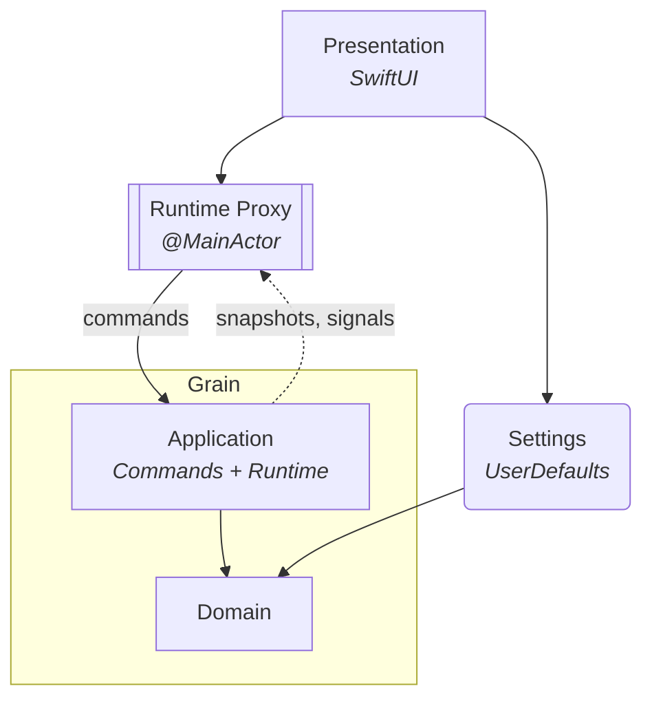

# Project Grain

A macOS menubar interval timer app. Alternates between two phases (A and B) on a repeating cycle.

**Stack:** Swift 6 · SwiftUI

## Features

- **Session persistence** — quitting the app or restarting the machine doesn't lose your session; running timers fast-forward through downtime on next launch, paused timers resume at the exact elapsed time
- **Configurable cycle length** — constant, growth, or decay mode controls whether phase durations stay equal or scale across cycles
- **System notifications** on phase and session completion

## Architecture

The app follows Domain-Driven Design with three layers, plus a **Settings** bounded context. Dependencies point inward.

The inner two layers — **Application** and **Domain** — live in the [Grain](https://github.com/vitalydolgov/grain) library, consumed as a dependency. **Presentation** and **Settings** live in this repository.



> The boxed pair (Application + Domain) is the *Grain* library — **Application** drives state transitions via commands and streams state back out; **Domain** holds the timer aggregates and invariants. **Presentation** renders the menubar UI. **Runtime Proxy** (subroutine shape) bridges the actor-based runtime to SwiftUI's `@Observable` system on the main actor. **Settings** (rounded rectangle) stores timer configuration and display preferences in `UserDefaults`; it depends on Domain for shared value types.

### Composition

- **Presentation** (`Sources/Presentation`) — SwiftUI views and `RuntimeProxy`, which bridges the actor-based runtime to `@Observable` on the main actor
- **Settings** (`Sources/Settings`) — a *bounded context* that owns configuration, display preferences, and session restore state
- **Application** and **Domain** — see the [Grain](https://github.com/vitalydolgov/grain) library

### Streaming

The Application layer emits two streams that flow back up to `RuntimeProxy`:

- **`snapshots`** — yields a fresh snapshot after every state change; `RuntimeProxy` consumes this to keep its observable properties in sync with the actor
- **`signals`** — surfaces discrete lifecycle events as the public output of the Application layer; `RuntimeProxy` forwards it as-is so Presentation subscribers can react without polling

## Building

Generate the Xcode project from `project.yml` with [XcodeGen](https://github.com/yonaskolb/XcodeGen):

```sh
xcodegen generate
```

Re-run `xcodegen generate` after any source tree change.

To build:

```sh
xcodebuild build -project GrainDesktop.xcodeproj -scheme GrainDesktop -destination 'platform=macOS'
```
