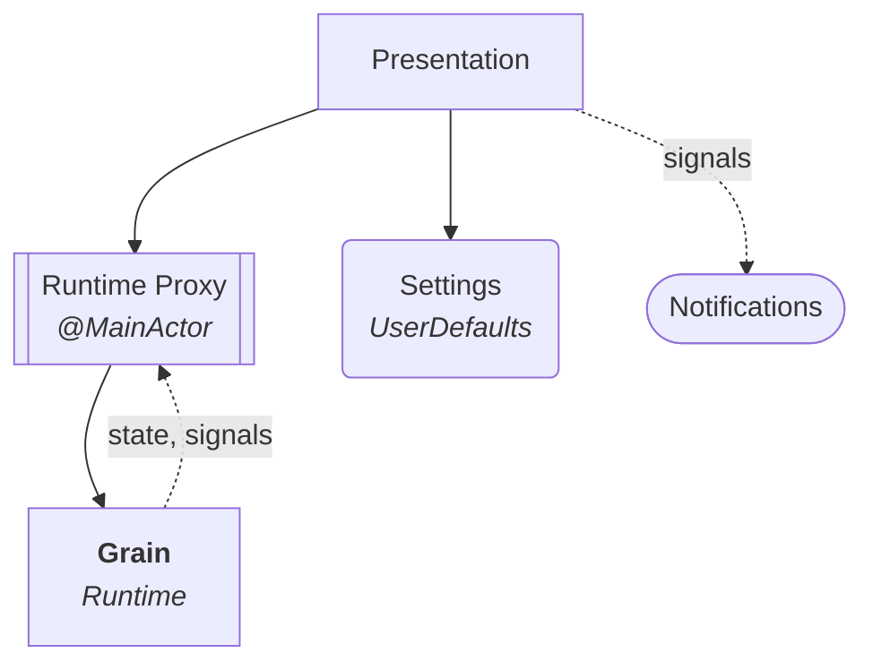
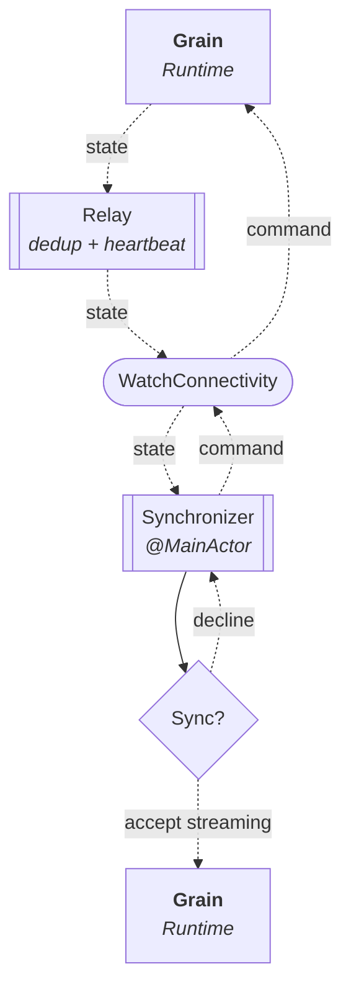

# Project Grain

An interval timer that alternates between focus and break phases on a repeating cycle. It ships as a macOS menubar app, a standalone iPhone app, and a watchOS companion to the phone; the Mac, phone, and watch each run their own timer, and the watch can optionally sync with — and remote-control — a session running on the phone.

**Stack:** Swift 6 · SwiftUI

## Features

- **Partition mode** — set a total time and the app computes the optimal split between focus and break phases
- **Three clients** — macOS, iOS, and watchOS apps sharing one design language, each adapted to its platform
- **Phone–watch sync** — the watch can mirror and remote-control a running phone session
- **Session persistence** — quitting the app or restarting the device doesn't lose your session; running timers fast-forward through downtime on next launch, paused timers resume at the exact elapsed time
- **Completion alerts** — every phase and session end is announced: a system notification on desktop, a haptic tap on watch and phone

## Architecture

The app follows Domain-Driven Design with three layers, plus a **Settings** bounded context; dependencies point inward. The inner two layers — **Application** and **Domain** — live in the [Grain](https://github.com/vitalydolgov/grain) library, consumed as a dependency. **Presentation** and **Settings** live in this repository.



Cross-device state propagation is described separately under [Synchronization](#synchronization).

### Composition

How each app is put together: its presentation, the shared pieces that support it, and the streams that connect them.

#### Three presentations

Each **Presentation** is built on its own Grain runtime (**Application** and **Domain** layers). In every one, a `RuntimeProxy` bridges the actor-based runtime to `@Observable` on the main actor:

- **Desktop** — macOS menubar and floating-window UI
- **Phone** — iOS UI; publishes its session to a paired watch and applies the remote commands the watch sends back
- **Watch** — watchOS UI; can optionally sync to a phone session and remote-control it

#### Supporting components

- **GrainComponents** — a cross-platform framework of shared SwiftUI building blocks (controls, interval indicators, and the theming primitives) that every presentation reuses
- **Settings** — a *bounded context* that owns configuration, display preferences, and session restore state
- **State transport** — a `WatchConnectivity` channel that carries runtime state from phone to the watch and routes runtime commands back from the watch to phone

#### Runtime streams

Each `RuntimeProxy` drives one stream into the Grain runtime and reads two back:

- **Commands** — the actions the UI issues, which the proxy applies to the runtime; on the phone these also arrive remotely from the watch
- **States** — a fresh snapshot after every change, which every proxy unpacks to keep its observable properties in sync
- **Signals** — discrete lifecycle events the presentation layer reacts to without polling: desktop notifications, watch and phone haptics

### Synchronization

The watch and the phone each run their own Grain runtime with full timer control. Optionally, the watch can sync with a running phone session and act as its remote: the **Relay** (`RuntimeStateRelay`) carries state over `WatchConnectivity`, phone to watch, and runtime commands flow back, watch to phone. The desktop is standalone and takes no part in synchronization.

The diagram below traces the sync flow top to bottom, from the phone (iOS) down to the watch (watchOS):



The relay forwards the phone runtime's **state** over the channel with two refinements: it **dedupes**, sending only when session status or phase actually changes, and a **heartbeat** re-sends the latest state so a watch that connects mid-session still discovers it.

Accepting the sync feeds that streamed state into the watch's *own* Grain runtime — so its `RuntimeProxy` and UI run the same contract as standalone, just sourced remotely.

While synced, the watch is a true remote: its controls publish **commands** back (sequence-tagged) to the phone, which applies them and streams the resulting state forward, keeping both devices in lockstep. When the phone session ends, the watch falls back to standalone control.

### Theming

Theming lives in the shared **GrainComponents** framework. A shared `AppTheme` tracks the system appearance (light/dark) and delegates color decisions to an `AppThemeFactory` that each app supplies — so the mechanism is shared while the palette stays per-platform. The theme is injected at the root of each app's view hierarchy and read from the environment in child views.

## Building

The project builds three application targets, each with its own scheme: **Desktop** (macOS 15.0), **Phone** (iOS 18.0), and **Watch** (watchOS 11.0). The watch app is embedded in the phone app, shipping as its companion.

Generate the Xcode project from `project.yml` with [XcodeGen](https://github.com/yonaskolb/XcodeGen). Create `local.yml` in the project root for developer-specific settings such as `DEVELOPMENT_TEAM`.

```sh
xcodegen generate
```

Re-run whenever you add, remove, or rename source files.

Build the desktop app:

```sh
xcodebuild build -project GrainApp.xcodeproj -scheme Desktop -destination 'platform=macOS'
```

Build the watch app:

```sh
xcodebuild build -project GrainApp.xcodeproj -scheme Watch -destination 'generic/platform=watchOS Simulator'
```

Build the phone app:

```sh
xcodebuild build -project GrainApp.xcodeproj -scheme Phone -destination 'generic/platform=iOS Simulator'
```
