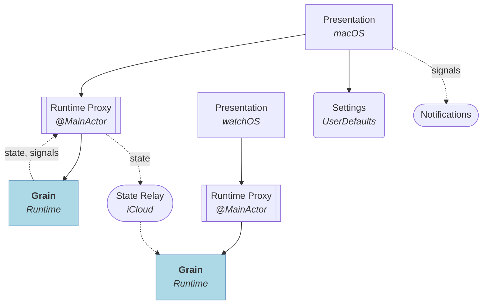

# Project Grain

A macOS menubar interval timer app with a watchOS companion display. Alternates between two phases (A and B) on a repeating cycle; the watch mirrors the current timer state as a read-only sidecar.

**Stack:** Swift 6 · SwiftUI

## Features

- **Session persistence** — quitting the app or restarting the machine doesn't lose your session; running timers fast-forward through downtime on next launch, paused timers resume at the exact elapsed time
- **Configurable cycle length** — constant, growth, or decay mode controls whether phase durations stay equal or scale across cycles
- **System notifications** on phase and session completion
- **A companion watchOS app** that mirrors the running timer state from the Mac in real time

## Architecture

The app follows Domain-Driven Design with three layers, plus a **Settings** bounded context. Dependencies point inward.

The inner two layers — **Application** and **Domain** — live in the [Grain](https://github.com/vitalydolgov/grain) library, consumed as a dependency. **Presentation** and **Settings** live in this repository.



### Composition

- **Desktop Presentation** (`Sources/Desktop/Presentation`) — macOS menubar UI; includes `RuntimeProxy`, which bridges the actor-based runtime to `@Observable` on the main actor
- **Settings** (`Sources/Desktop/Settings`) — a *bounded context* that owns configuration, display preferences, and session restore state
- **Watch Presentation** (`Sources/Watch/Presentation`) — watchOS sidecar UI; includes its own `RuntimeProxy` populated via the relay rather than by commanding the runtime directly
- **Relay** (`Sources/Shared/Infrastructure`) — propagates runtime state between devices over iCloud; one-way, no commands flow back
- **Application** and **Domain** — see the [Grain](https://github.com/vitalydolgov/grain) library

### Streaming

The Grain runtime emits two streams consumed by `RuntimeProxy`:

- **state** — yields a fresh `RuntimeState` after every change; `RuntimeProxy` unpacks it to keep its observable properties in sync. Both Desktop and Watch proxies consume this stream.
- **signals**  — surfaces discrete lifecycle events; Desktop `RuntimeProxy` exposes them so Presentation can react without polling. The Watch proxy does not consume signals.

## Building

Generate the Xcode project from `project.yml` with [XcodeGen](https://github.com/yonaskolb/XcodeGen). Create `local.yml` in the project root for developer-specific settings such as `DEVELOPMENT_TEAM`.

```sh
xcodegen generate
```

Re-run whenever you add, remove, or rename source files.

To build:

```sh
xcodebuild build -project GrainDesktop.xcodeproj -scheme GrainDesktop -destination 'platform=macOS'
```
