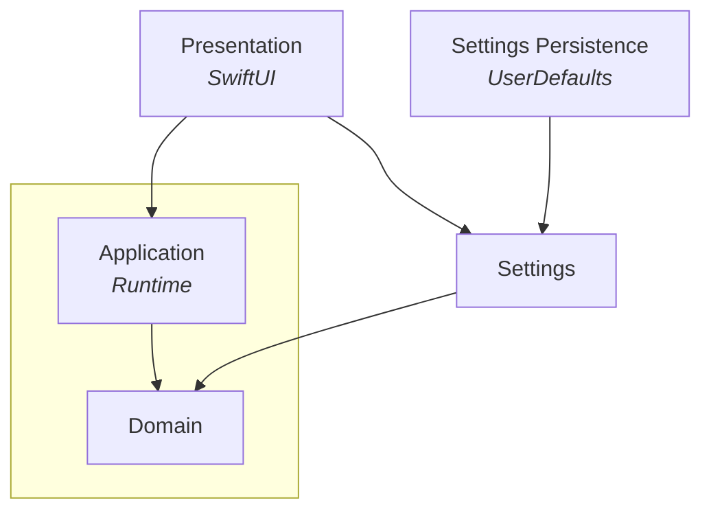

# Grain (desktop)

A macOS menubar interval timer app. Tracks focus and break sessions with a configurable work/break cadence. Built on top of the [Grain](https://github.com/vitalydolgov/grain) library, which provides the domain model, application logic and runtime.

## Architecture

The app follows Domain-Driven Design with four components. Dependencies point inward.



The Grain library (at `Core/`) owns the Application and Domain layers. This repository provides the remaining three:

- **Presentation** — SwiftUI views and `RuntimeProxy`, which bridges the actor-based runtime to the `@Observable` system on the main actor
- **Settings** — store protocols and facades for timer configuration (`TimerSettings`) and display preferences (`DisplaySettings`); depends on Domain for shared value types
  - **Settings Persistence** — `UserDefaults`-backed implementations of the Settings store protocols

## Building

The project uses [XcodeGen](https://github.com/yonaskolb/XcodeGen) to generate the Xcode project file, and the Grain library is included as a git submodule at `Core/`.

```sh
# Initialize submodule
git submodule update --init

# Generate project
xcodegen generate

# Open in Xcode
open GrainDesktop.xcodeproj
```
